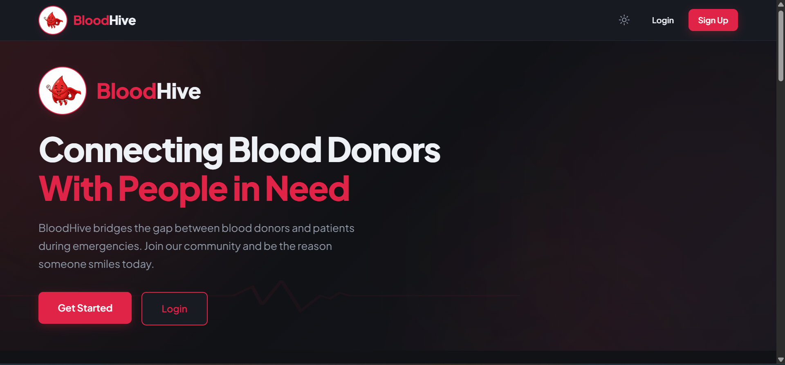
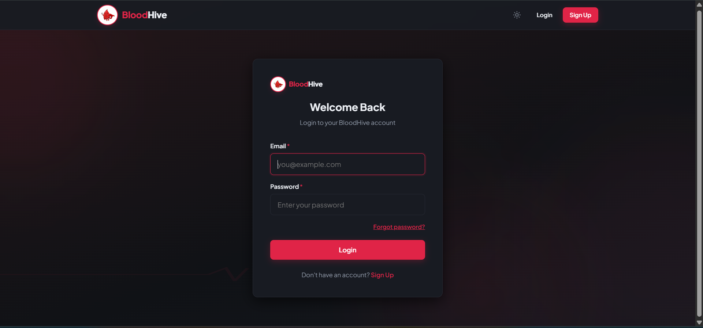
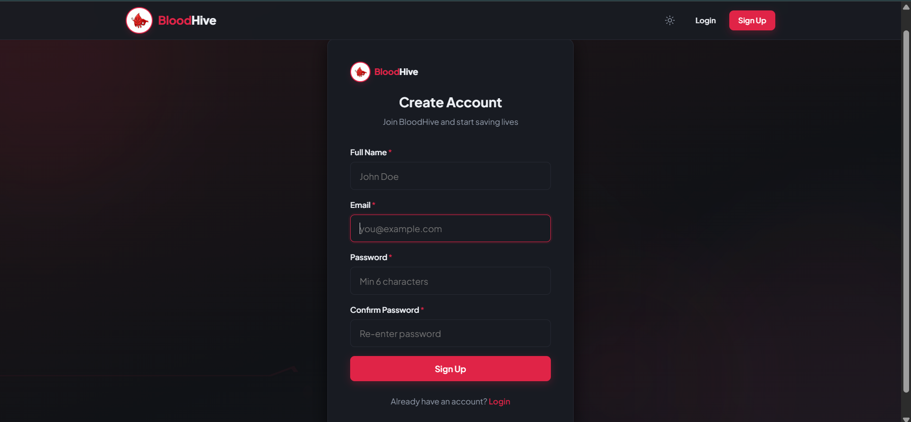
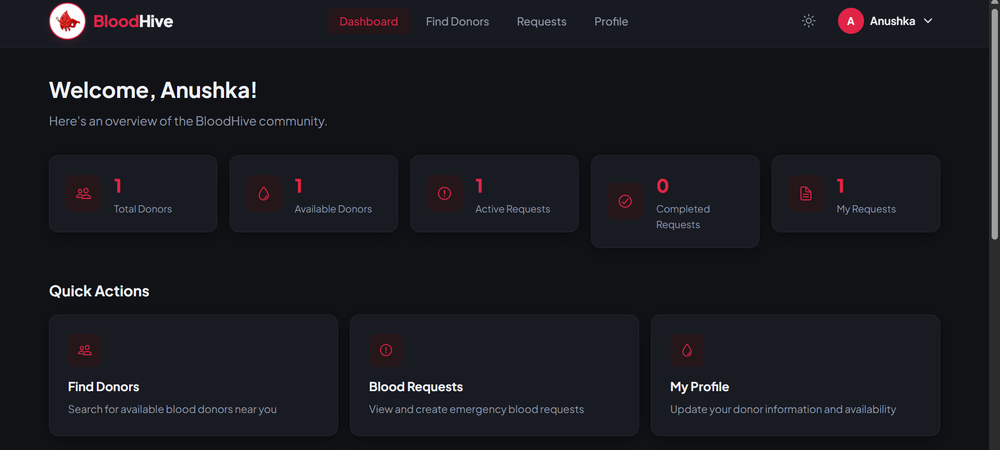
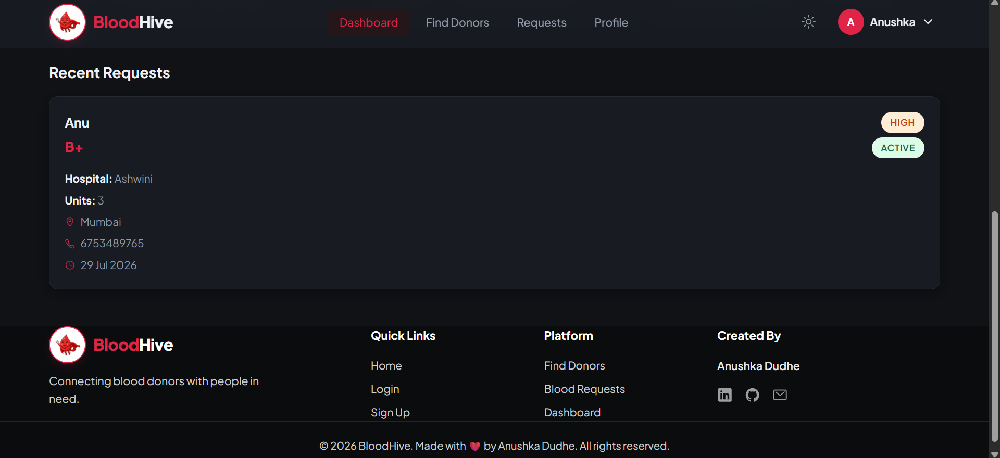
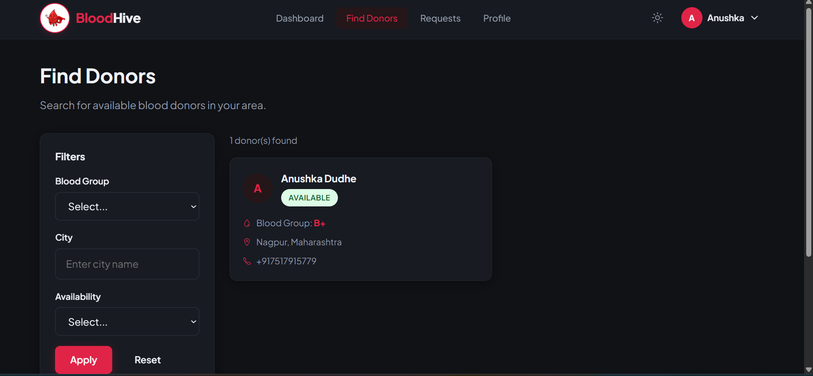
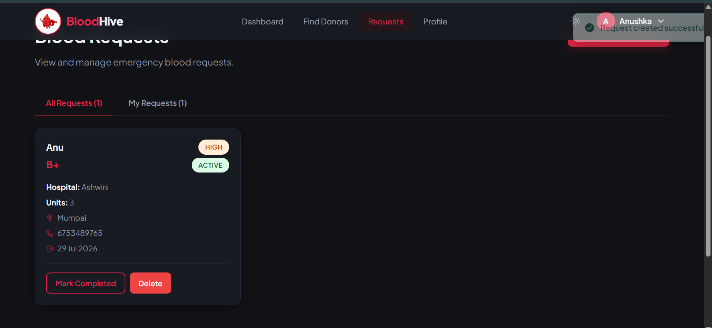
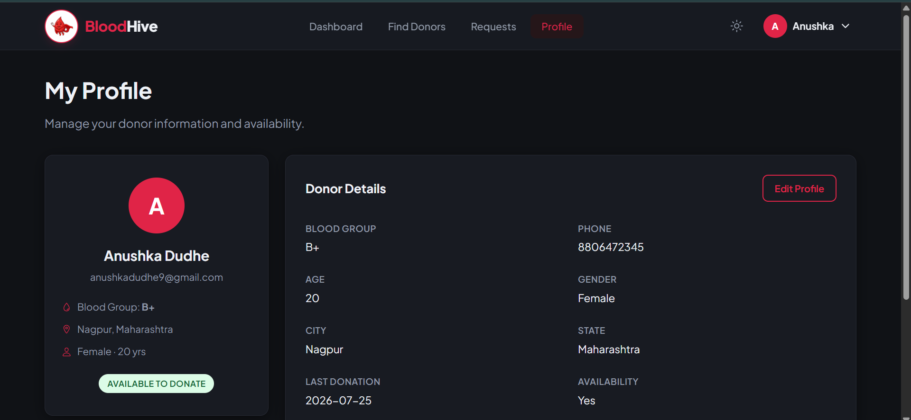

<div align="center">

# 🩸 BloodHive


### Connecting Blood Donors with People Who Need Them ❤️

A modern full-stack blood donation platform that helps patients quickly find nearby blood donors based on blood group, location, and availability.

Built with **React, Node.js, Express, MongoDB, JWT Authentication**.


</div>

---

# ❤️ About BloodHive

BloodHive is a modern blood donation platform developed to bridge the gap between blood donors and recipients.

Instead of manually searching through contacts or social media, BloodHive enables users to instantly discover verified blood donors based on:

- 🩸 Blood Group
- 📍 City
- ✅ Availability Status

The platform provides secure authentication, donor discovery, request management, and user profile management through a clean and responsive interface.

---

# ✨ Features

## 👤 Authentication

- Secure User Registration
- Login using JWT Authentication
- Password Hashing with bcrypt
- Protected Routes
- Persistent Login

---

## 🩸 Donor Discovery

- Search by Blood Group
- Search by City
- Availability Filter
- Combined Filters
- Instant Results

---

## ❤️ Blood Requests

- Create Blood Request
- View Requests
- Update Request Status
- Delete Request
- Manage Personal Requests

---

## 👨‍💻 User Dashboard

- Profile Management
- Availability Toggle
- Dashboard Overview
- Request History
- Donor Statistics

---

# 🛠 Tech Stack

## Frontend

- React
- React Router DOM
- Axios
- CSS3
- Context API

## Backend

- Node.js
- Express.js
- MongoDB Atlas
- Mongoose
- JWT Authentication
- bcrypt

## Deployment

- Vercel (Frontend)
- Render (Backend)
- MongoDB Atlas

---

# 📂 Project Structure

```
BloodHive
│
├── client
│   ├── src
│   ├── public
│   └── package.json
│
├── server
│   ├── config
│   ├── controllers
│   ├── middleware
│   ├── models
│   ├── routes
│   ├── utils
│   └── server.js
│
├── screenshots
│
└── README.md
```

---

# 📸 Project Showcase

---

# 🌟 Landing Experience

> The welcoming homepage introduces BloodHive with smooth animations, a clean interface, and clear navigation.

<p align="center">

</p>

---

# 🔐 Secure Login

> JWT-based authentication ensures secure access to user accounts.

<p align="center">

</p>

---

# 📝 User Registration

> New users can quickly join the BloodHive community by creating an account.

<p align="center">

</p>

---

# 📊 Dashboard

> Personalized dashboard displaying profile details and important information.

<p align="center">





</p>

---

# 🔍 Find Blood Donors

> Instantly search available donors using multiple filters.

<p align="center">

</p>

---

# ❤️ Blood Requests

> Create and manage blood donation requests efficiently.

<p align="center">

</p>

---

# 👤 User Profile

> Manage profile information and donor availability.

<p align="center">

</p>

---

# 🔐 Security Features

- JWT Authentication
- Password Hashing using bcrypt
- Protected API Routes
- MongoDB Validation
- Secure Environment Variables
- Authentication Middleware
- Error Handling

---

# 🌍 REST API

| Method | Endpoint | Description |
|----------|----------------------|----------------|
| POST | /api/auth/signup | Register User |
| POST | /api/auth/login | Login User |
| GET | /api/users/profile | User Profile |
| PUT | /api/users/profile | Update Profile |
| GET | /api/users/donors | Search Donors |
| POST | /api/requests | Create Request |
| GET | /api/requests | Get Requests |
| PUT | /api/requests/:id | Update Request |
| DELETE | /api/requests/:id | Delete Request |

---

# ⚙ Installation

## Clone Repository

```bash
git clone https://github.com/LogicVortex123/BloodHive.git
```

```
cd BloodHive
```

---

## Backend

```
cd server
```

Install dependencies

```bash
npm install
```

Create `.env`

```env
PORT=5000

MONGO_URI=YOUR_MONGODB_URI

JWT_SECRET=YOUR_SECRET_KEY
```

Run

```bash
npm run dev
```

---

## Frontend

```
cd client
```

Install

```bash
npm install
```

Create `.env`

```env
VITE_API_URL=http://localhost:5000/api
```

Run

```bash
npm run dev
```

---

# 🚀 Deployment

Frontend deployed on **Vercel**

Backend deployed on **Render**

Database hosted on **MongoDB Atlas**

---

# 📈 Future Enhancements

- 📱 Mobile Application
- 📍 Live Nearby Donor Detection
- 📧 Email Notifications
- 📞 Emergency Contact Alerts
- 🩸 Blood Camp Registration
- 🔔 Push Notifications
- 🤖 AI-based Donor Recommendation

---

# 👩‍💻 Author

**Anushka Dudhe**

B.Tech CSE (AI & ML)

Passionate Full Stack Developer • Open Source Contributor • AI Enthusiast

GitHub:
https://github.com/LogicVortex123

LinkedIn:
https://www.linkedin.com/in/anushka-dudhe-22549b369/

---

<div align="center">

## ❤️ Every Drop Counts.

### BloodHive — Connecting Donors. Saving Lives.

</div>
